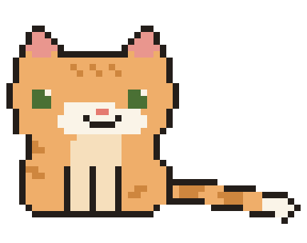

### Hi, I'm Pieter 👋

 

- 🎓 Bachelor's in Applied Computer Science, currently pursuing a Master's in Electronics
- 💻 Full-stack developer from Belgium

### 🧰 Things I code with

| | |
| --- | --- |
| **Languages** |       |
| **Frameworks, platforms & libraries** |      |
| **Hosting / SaaS** |    |
| **Servers** |   |
| **Databases / ORM** |     |
| **CI/CD** |   |
| **VCS** |     |
| **Other** |     |
